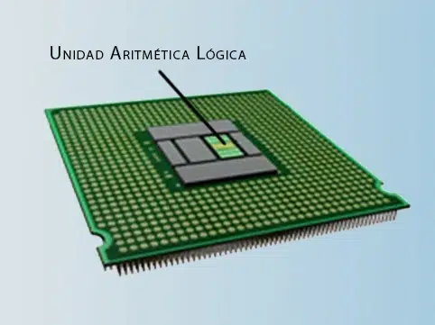
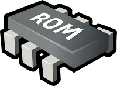

# ACTIVIDAD 1
En el desarrollo de esta actividad se mostrará el siguiente contenido:
 1. Investigación acerca de los componentes de un procesador.
 2. Simulador Digital. 
 3. Concepto de programa.
 4. Fetch-decode-execute.
 5. Instrucciones tipo c.
 6. Compuertas lógicas de la CPU.
 7. CPU Emulator 

## 1. Investigación acerca de los componentes de un procesador 

A continuación se presentarán las partes importantes que tiene un procesador, y se puede ver todos los conceptos que se van a ver mediate la tabla de contenido:

### 1. CPU (Central Porcessing Unit)

Al hablar de la CPU se puede definir como el componente principal de todo ordenador ya que que es "el cerebro activo" del ordenador donde está formada por un conjunto de circuitos electrónicos que pueden ejecutar el OS (sistema operativo) ademas de ejecutar las aplicaciones que tiene el ordenador y otras operaciones informaticas. Puede realizar varias tareas y regula las funciones internas, supervisando el consumo de energía, etc... No solo se encuentran en el computador, tambien se encuentran en el smartphone, tableta o en cualquier dispositivo electrónico.


También la CPU ejecuta una secuencia de instrucciones y procesa los datos de las mismas, donde las instrucciones son las que realizan los programas para desarrollar aquella tarea que se le indica

### 2. ALU (Unidad Aritmético Lógica)

Se define como un circuito digital donde lo que hace es que calcula operaciones aritméticas y operaciones lógicas entre dos numeros.

Como por ejemplo la suma, resta, multiplicación, división, etc... y logicas como AND, OR, NOT, XOR sobre datos binarios. Donde a partir de estas operacines permite el funcionamiento de los programas y procesos del sistema.



### 3. Registros

Son pequeñas unidades donde se almacenan a alta velocidad ubicadas dentro de la CPU, donde guardan temporalmente datos e intrucciones que necesita la CPU, los registros se dividen en dos:
 1. Registros de Porposito General
 2. Registros Especificos

#### Registros de proposito general

También conocidos como GPR son aquellos registros que pueden almacenar datos temporales, direcciones de memoria o resultados intermedios de operaciones. Estos pueden usarse de manera flexible 
según las necesidades que tenga el programa, sus principales características son un uso versatil, tienen alta velocidad y son de cantidad variable

#### Registros Específicos

Este tipo de registros son diseñados para realizar funcioes concretas dentro de la CPU, estos tienen una función definida dentro del ciclo de ejecución de instrucciones 
podemos ver el ejemplo del contador del programa (Program Counter) que en este caso guarda la dirección de la proxima instruccion a ejecutar o tambien del puntero de silla (Stack Pointer) que se
encarga del apuntar al tope de la pila de memoria.

### 4. Unidad de Control 

Es ua de las partes fundamentales de un procesador debido a que se encarga de dirigir y coordinar la ejecución de instrucciones dentro de la CPU podemos enumerar las funciones de la unidad de control:

 1. Decodificación de instrucciones
 2. Generación de señales de control
 3. Gestión del flujo de instrucciones
 4. Coordinación con la ALU
 5. Gestión de la memoria y los registros 


### 5. Buses de datos y de dirección

Son canales de comunicación que permite la transferencia de información entre la CPU, la memoria y otros dispositivos del sistema. 

#### Buses de datos

La función de este tipo de buses es que transporta los datos entre el procesador la memoria y los perifericos, donde puede leer y escribir datos en la memoria o en los dispositivos de entrada y de salida.


#### Buses de dirección 

Su función principal es cuando el procesador necesita acceder a la memoria se usa para indicar en este caso la ubicación de la memoria.

### 6. Memoria RAM y Memoria ROM

Son dos tipos de memoria que se diferencian en sus características.
 
 1. Memoria RAM: Su función principal es que almacena datos e instrucciones temporalemente mientras el sistema está en funcionamiento.

 

 2. Memoria ROM: Su función es almacenar los datos de manera permanente para el arranque y funcionamiento del sistema.

 

Respecto a la vigencia de los terminos utilizados, en la actualidad la RAM si es un termino actual, mientras que la ROM ha sido reemplazada por tecnologías más flexibles como Flash, EEPROM o NAND pero se utilizan para referirse al firmware y los almacenamientos en sistemas embebido.

### 7. OPCODE

También llamado como un código de operación es aquello que se emiten órdenes de la parte del software hacia la parte del hardware. Donde cada dispositivo posee una manera distinta de emitir y recoger esas ordenes.

## 2. SIMULADOR DIGITAL

A partir de un software como lo es el simulador Digital, lo que hacemos es simular una el siguiente computador de 16 bits, donde hay 3 partes importantes: la ROM, la CPU y la Memoria. Como se ve en la figura 1.


Al ejecutarlo tenemos el circuito del computador el cual vemos a simple vista el CPU y la Memoria, donde el funcionamiento consiste en que la señal del pc sale con una dirección que entra en la ROM y una vez allí procesa la dirección para dar la siguiente instrucción al computador.
### Circuito de CPU


### Circuito de memoria


## 3. CONCEPTO DE PROGRAMA

Un programa es un conjunto de instrucciones donde la computadora puede ejecutar para poder realizar una tarea especifica, donde estas ordenes están basadas en un lenguaje de programación. 


Donde dependiendo de el estado en que esté el programa, esté ubicado en diferentes lugares como:
1. Almacenamiento Permanente: Se guarda en el disco duro, y ahí permanece hasta cuando la computadora está apagada.
2. RAM: El programa está en este almacenamiento, cuando se está ejecutando para que el procesador pueda acceder a las instruccioes y pueda ejecutarlas.
3. Caché del procesador: Cuando alguna de las partes del programa son utilizadas frecuentemente se ubican en el Caché para aumentar la velocidad de su ejecución.

Cuando ponemos un comentario en el programa como "//Variable tipo contador" solo estaría en el disco duro pero por lo demás no se almacena ni en la RAM ni en el caché.

Una variable se almacena en la memoria RAM, debido a que cuando se ejecuta el programa, la variable reserva un espacio en la memoria.

## 4. fetch-decode-execute

Este tipo de procesos que tiene la CPU, se basan en tres pasos: Buscar-Decodificar-Ejecutar.

Para ponerlo claramente, en un ejemplo donde el programa ejecuta una suma:

```R1+R2```

Donde el buscar sea que se encargue de buscar las variables r1 y r2. Donde el decodificar se que siga la instrucción del programa que es buscar las variables r1 y r2 realizar la operación Y por ultimo al ejecutar, realiza el programa donde nos pide las variables r1 y r2 y hace la operación.

## 5. Instrucciones tipo C 

En este caso el procesador que estamos estudiando utiliza instrucciones tipo c, donde son complejas y pueden realizar variedad de operaciones y controlar el flujo de programa. Donde se caracterizan por tener 3 bits de mayor peso en 1.

## Ejemplo

Consideremos la instrucción 0xEC10, que se decodifica como D=A. Esta instrucción es de tipo C y realiza la siguiente operación: Operación: Lee el valor del registro A. Destino: Almacena el valor leído en el registro D. Salto: No se realiza ningún salto. En este caso, la CPU lee el valor del registro A y lo almacena en el registro D, lo que permite manipular y transferir datos entre registros de manera eficiente.

## 6. Instruccione tipo C
1. Instrucciones Aritméticas y Lógicas: Realizan operaciones matemáticas o lógicas. Ejemplo: ADD R1, R2, R3 suma los valores de R2 y R3 y guarda el resultado en R1.
2. Instrucciones de Movimiento de Datos: Mueven datos entre registros o memoria. Ejemplo: MOV R1, #5 carga el valor 5 en R1.
3. Instrucciones de Control de Flujo: Modifican el orden de ejecución, como saltos. Ejemplo: JMP 1000 salta a la dirección de memoria 1000.
4. Instrucciones de Comparación: Comparan dos valores y ajustan las banderas del procesador. Ejemplo: CMP R1, R2 compara R1 con R2.
5. Instrucciones de Entrada/Salida (I/O): Gestionan la comunicación con dispositivos externos. Ejemplo: IN R1, 0x01 lee un valor de un puerto de entrada y lo guarda en R1.

## 7. Decodificación por parte de la CPU
